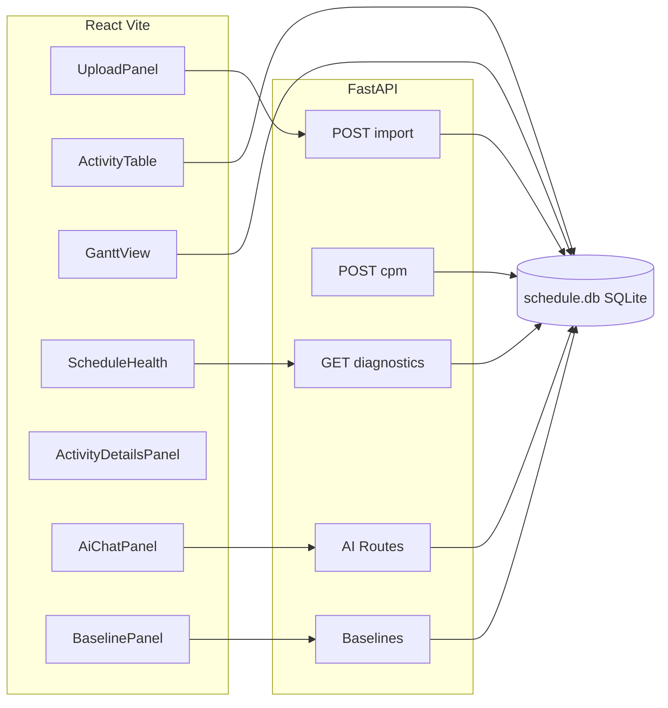

# Primavera P6 XER Local Analyzer

Single-user, offline tool to import Oracle Primavera P6 **.xer** files, store data in **SQLite**, run a Python **CPM/PDM** engine (FS/SS/FF/SF, no third-party CPM libraries), and review results in a **React + Vite** UI with an **activity table** (virtual scrolling), **dhtmlxGantt** chart (dependency lines, critical styling, progress bars, today marker, day/week/month zoom), **Schedule Health** diagnostics (DCMA 14-Point Assessment), **AI assistant**, **baselines**, and more. Exports: **Excel** for activities/CPM columns, **CSV** for diagnostics.

## Architecture



- **Backend:** FastAPI (`main.py`), streaming XER (`xer_parser.py`), hand-written CPM (`cpm_engine.py`), diagnostics (`diagnostics.py`), AI engine (`ai_engine.py`), AI routes (`ai_routes.py`), SQLite (`database.py`), shared constants (`constants.py`), shared queries (`deps.py`).
- **Frontend:** Vite + React (JavaScript); relative `/api` URLs only (Vite proxy in dev).
- **Gantt:** [dhtmlx-gantt](https://github.com/DHTMLX/gantt) (GPL-2.0). Commercial use may require a separate license.

**Schema changes:** If you upgraded from an older build, delete `backend/schedule.db` and re-import your `.xer` files.

## Features

### Core CPM
- **CPM/PDM Engine:** Forward and backward passes with FS/SS/FF/SF links, lag, and iterative relaxation
- **Constraint Support:** SNET, FNLT, MSO, MFO constraints in CPM calculation
- **Progress Tracking:** Actual start/finish, remaining duration, percent complete with retained logic scheduling
- **Critical Path:** Full longest-path tracing and near-critical detection (< 5 working days of float)

### AI Assistant
- **Claude-powered Analysis:** Schedule analysis and modification via natural language (requires `ANTHROPIC_API_KEY` in `backend/.env`)
- **Quick Actions:** Summarize, Critical Path, DCMA Review, Fix Open Ends, Float Analysis, Network Analysis
- **AI Suggestions:** Context-aware fix recommendations with one-click application
- **Auto-Fix Generator:** Rule-based fixes for open ends and missing logic (no API key needed)
- **Markdown Rendering:** AI responses rendered with full markdown support (headers, code blocks, tables, lists)

### DCMA 14-Point Assessment
- Automated pass/fail scoring for all 14 DCMA checks
- Check-by-check breakdown display with visual pass/fail cards
- Missing predecessors/successors, high float, negative float, high duration, hard constraints, relationship ratio, lags, leads, SF relationships, critical path ratio, invalid dates, open starts, open ends

### Baselines
- Save, compare, and delete schedule baselines
- Variance analysis: start variance, finish variance, duration variance

### Network Analysis
- Critical path drivers, float consumption risks, logic gaps
- Relationship density analysis and overall schedule score

### Activity Management
- **Inline Editing:** Name, duration, WBS, and milestone status
- **Relationship Editing:** View, add, and delete predecessors/successors from the Activity Details Panel
- **WBS Management:** Create and update WBS nodes, group activities by WBS
- **Virtual Scrolling:** Handles schedules with 5000+ activities smoothly
- **Sort Indicators:** Visual arrows showing sort column and direction

### Gantt Chart
- Dependency lines with FS/SS/FF/SF support
- Critical task highlighting (red)
- Progress bars showing percent complete
- Today marker
- Dynamic date range based on project data
- Day/Week/Month zoom levels
- Click-to-select: clicking a Gantt bar selects the activity in the table

### Import & Export
- **Drag-and-drop** or file picker for .xer import
- P6 date format parsing: ISO strings, `YYYY-MM-DD`, `DD-MMM-YY`, and numeric hours
- **Excel export** for activities/CPM schedule
- **CSV export** for diagnostics findings
- **Project deletion** with confirmation dialog

### UI
- Dark/light theme toggle
- Error boundary component for graceful failure recovery
- Resizable split panes (table | Gantt)
- Scroll sync between table and Gantt

## Prerequisites

- Python 3.10+ recommended (3.9+ tested)
- Node.js 18+ with npm

## Install

### Backend

```bash
cd backend
python3 -m venv .venv
source .venv/bin/activate   # Windows: .venv\Scripts\activate
pip install -r requirements.txt
```

### Frontend

```bash
cd frontend
npm install
```

### AI Assistant (optional)

```bash
cp backend/.env.example backend/.env
# Edit backend/.env and set ANTHROPIC_API_KEY=sk-ant-...
```

## Run locally

Terminal 1 — API (from `backend/` so `main:app` resolves):

```bash
cd backend
source .venv/bin/activate
uvicorn main:app --reload
```

Terminal 2 — UI:

```bash
cd frontend
npm run dev
```

Open the URL Vite prints (typically `http://localhost:5173`). The Vite dev server proxies `/api` to `http://127.0.0.1:8000`.

## Usage

1. **Import** a `.xer` file by dragging it onto the upload zone or using the file picker.
2. Select the **project** from the dropdown.
3. Click **Run CPM** to compute early/late times, total float, and critical flags.
4. Use tabs: **Activity Details** (view/edit, relationships), **Schedule Health** (DCMA, diagnostics, auto-fixes, AI suggestions), **Baselines** (save/compare/delete).
5. Click the **AI** button (bottom-right) to open the schedule assistant.
6. **Export** activities (.xlsx) and diagnostics (.csv) from the sidebar.

## Tests

```bash
cd backend
source .venv/bin/activate
pytest
```

Test suites:
- `test_xer_parser.py` — XER parsing, constraint date format handling
- `test_cpm_engine.py` — CPM chains, parallel paths, lag, SS/SF, cycles, constraints, retained logic
- `test_diagnostics.py` — Open ends, DCMA scoring, negative float, near-critical, truncation
- `test_baselines.py` — Baseline save/compare/increment

## Limitations

- **Calendars / dates:** Uses continuous **work hours** from P6 `target_drtn_hr_cnt` and lags; calendar exceptions are not modeled. On-screen dates are **linear projections** (8 h/day), not P6 calendar dates.
- **ALAP constraint:** Not yet implemented.
- **SF relationships:** Implemented with the PDM mirror formulation in `cpm_engine.py`; validate against P6 on critical schedules if needed.
- **PDM:** Implemented with iterative relaxation suitable for typical DAGs; validate critical projects against P6 if needed.

## Database file

SQLite database path: `backend/schedule.db` (created on first import).
