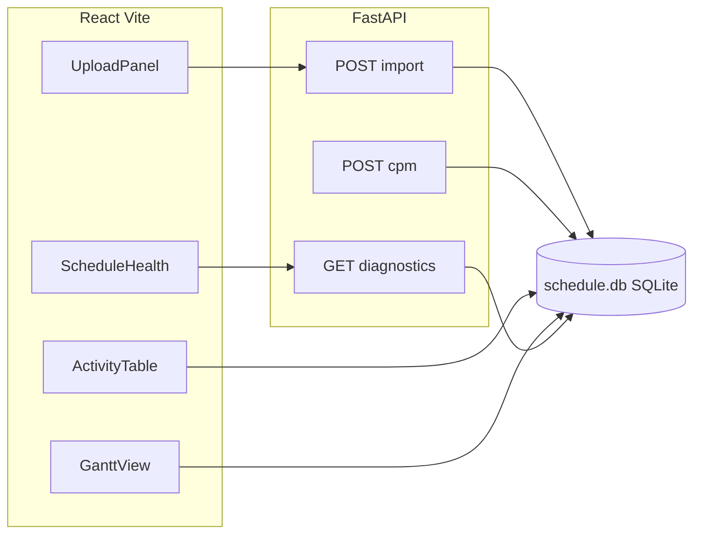

# Primavera P6 XER Local Analyzer

Single-user, offline tool to import Oracle Primavera P6 **.xer** files, store data in **SQLite**, run a Python **CPM/PDM** engine (FS/SS/FF/SF, no third-party CPM libraries), and review results in a **React + Vite** UI with an **activity table**, **dhtmlxGantt** chart (dependency lines, critical styling, day/week/month zoom), and **Schedule Health** diagnostics. Exports: **Excel** for activities/CPM columns, **CSV** for diagnostics.

## Architecture



- **Backend:** FastAPI (`main.py`), streaming XER (`xer_parser.py`), hand-written CPM (`cpm_engine.py`), diagnostics (`diagnostics.py`), SQLite (`database.py`).
- **Frontend:** Vite + React (JavaScript); relative `/api` URLs only (Vite proxy in dev).
- **Gantt:** [dhtmlx-gantt](https://github.com/DHTMLX/gantt) (GPL-2.0). Commercial use may require a separate license.

**Schema changes:** If you upgraded from an older build, delete `backend/schedule.db` and re-import your `.xer` files.

## Prerequisites

- Python 3.10+ recommended (3.9+ tested)
- Node.js 18+ with npm

## Install

### Backend

```bash
cd backend
python3 -m venv .venv
source .venv/bin/activate   # Windows: .venv\Scripts\activate
pip install -r requirements.txt
```

### Frontend

```bash
cd frontend
npm install
```

## Run locally

Terminal 1 — API (from `backend/` so `main:app` resolves):

```bash
cd backend
source .venv/bin/activate
uvicorn main:app --reload
```

Terminal 2 — UI:

```bash
cd frontend
npm run dev
```

Open the URL Vite prints (typically `http://localhost:5173`). The Vite dev server proxies `/api` to `http://127.0.0.1:8000`.

## Usage

1. **Import** a `.xer` file in the left sidebar.
2. Select the **project** from the dropdown.
3. Click **Run CPM** to compute early/late times, total float, and critical flags (hour-based schedule from time 0; display uses a linear hour→calendar mapping in the Gantt).
4. Use tabs: **Activities** (sort/filter), **Gantt** (links, critical bars, zoom), **Schedule Health** (rules + export CSV).
5. **Export activities (.xlsx)** and **diagnostics (.csv)** from the upload panel or Schedule Health tab.

## Tests

```bash
cd backend
source .venv/bin/activate
pytest
```

Synthetic XER strings and small CPM graphs are covered in `backend/tests/`.

## UI overview

- **Sidebar:** File upload (with progress text), project selector, **Run CPM**, KPI chips, export buttons, theme toggle (defaults to `prefers-color-scheme`).
- **Activities:** Sortable columns; critical rows highlighted; filter text and “critical only”.
- **Gantt:** Dependency lines, critical task class (red), zoom **Day / Week / Month**.
- **Schedule Health:** Open ends, excessive duration (default threshold 2000 h), heuristic “missing FS/FF predecessor”, % critical; findings capped at 500 rows.

## Limitations

- **Calendars / dates:** Phase 1 uses continuous **work hours** from P6 `target_drtn_hr_cnt` and lags; calendar exceptions are not modeled. On-screen dates are **linear projections** (8 h/day), not P6 calendar dates.
- **SF relationships:** Implemented with the PDM mirror formulation in `cpm_engine.py`; validate against P6 on critical schedules if needed.
- **PDM:** Implemented with iterative relaxation suitable for typical DAGs; validate critical projects against P6 if needed.

## Database file

SQLite database path: `backend/schedule.db` (created on first import).
